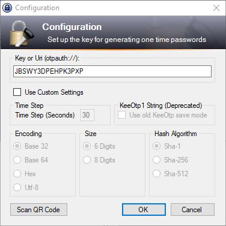
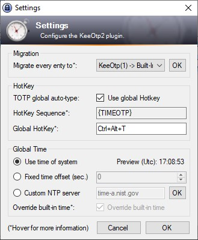
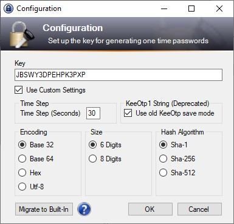

# KeeOtp2

KeeOtp2 is a plugin for [KeePass](http://keepass.info). It provides a form to display one time passwords. The TOTP secret keys are stored in a normalized format, so this plugin is fully compatible with the built-in OTP function. It also can be used as a GUI for the built-in OTP function. *(The plugin can also migrate saved [KeeOtp(1)](https://github.com/tiuub/KeeOtpMirror) secrets, to the new built-in function.)*

> This plugin is based on [KeeOtp(1)](https://github.com/tiuub/KeeOtpMirror), which was originally developed by [devinmartin](https://bitbucket.org/devinmartin). Since [devinmartin](https://bitbucket.org/devinmartin)s website is no longer available, I have reuploaded the original source code [here](https://github.com/tiuub/KeeOtpMirror) (or at [archive.org](http://web.archive.org/web/20200621144226/https://bitbucket.org/devinmartin/keeotp/wiki/Home)).

## Installation

 - Download the latest release [here](https://github.com/tiuub/KeeOtp2/releases/latest)
 - Copy the KeeOtp2.plgx in the KeePass plugins directory and restart the application.

### Alternative Installation

- Using [chocolatey](https://chocolatey.org/) in Powershell with `choco install keepass-plugin-keeotp2`

## Usage

### Configure TOTP

Rightclick on a entry and click on **Timed One Time Password**.

This will open the configuration window.

Enter the key you have received and press **OK**.

The TOTP should now be visible.

### Migrate from KeeOtp1 to KeeOtp2/Built-In OTP

Click on **Tools**, navigate to **KeeOtp2** and press **Settings**.

You can migrate all of your entries to KeeOtp2/Built-In OTP by clicking on **Migrate**.

### Or

Just right click any entry in your database and click on **Timed One Time Password**.

Click on **Edit**. When the configuration window is opened, click on **Migrate to Built-In**.

## Download

You can download the .plgx file [here](https://github.com/tiuub/KeeOtp2/releases/latest).

## Auto-Type

### HotKey
Default HotKey: **CTRL + ALT + T**

You can set a global hotkey to auto-type your TOTP.
Therefore you have to click on **Tools**, navigate to **KeeOtp2** and press **Settings**.
There you can activate or disable the global hotkey and set your own key combination.

### Placeholder

This plugin supports the built-in [Auto-Type](https://keepass.info/help/base/autotype.html) function.

Placeholder | Usage
--- | ---
**{TOTP}** | Was used by KeeOtp(1) *(Deprecated)*
**{TIMEOTP}** | Can be used with KeeOtp2 and built-in TOTP *(Recommended)*

Still you can use **{TOTP}**, but its rather recommended to use the built-in placeholder **{TIMEOTP}**.

## Global Time

You can configure your specific time for generating TOTPs. Therefore you have three options in the *Settings* form.

*Use time of system* - This will basically use the time of your system*

*Fixed time offset (sec.)* - This will set a fixed time offset to your systemtime. (For example if you know, your system is running 5 seconds behind or 50 seconds forward.)

*Custom NTP server* - This will poll the given NTP server to get the current and correct time.
 

## License

### Dependencies

**KeeOtp(1)** ([source](https://github.com/tiuub/KeeOtpMirror)/[archive](http://web.archive.org/web/20200621144226/https://bitbucket.org/devinmartin/keeotp/wiki/Home)) by [devinmartin](https://bitbucket.org/devinmartin) - License: [MIT](https://github.com/tiuub/KeeOtp2/blob/master/Dependencies/KeeOtp/LICENSE)

**OtpSharp** ([source](https://bitbucket.org/devinmartin/otp-sharp/wiki/Home)/[archive](http://web.archive.org/web/20200805171740/https://bitbucket.org/devinmartin/otp-sharp/wiki/Home) or [NuGet](https://www.nuget.org/packages/OtpSharp/)) by [devinmartin](https://bitbucket.org/devinmartin) - License: [MIT](https://github.com/tiuub/KeeOtp2/blob/master/Dependencies/OtpSharp/LICENSE)

**QRCoder** ([source](https://github.com/codebude/QRCoder/) or [NuGet](https://www.nuget.org/packages/QRCoder/)) by [codebude](https://github.com/codebude) - License: [MIT](https://github.com/tiuub/KeeOtp2/blob/master/Dependencies/QRCoder/LICENSE)

**Yort.Ntp.Portable** ([source](https://github.com/Yortw/Yort.Ntp) or [NuGet](https://www.nuget.org/packages/Yort.Ntp.Portable/)) by [Yortw](https://github.com/Yortw) - License: [MIT](https://github.com/tiuub/KeeOtp2/blob/master/Dependencies/Yort.Ntp.Portable/LICENSE)

**ZXing.Net** ([source](https://github.com/micjahn/ZXing.Net/) or [NuGet](https://www.nuget.org/packages/ZXing.Net/)) by [micjahn](https://github.com/micjahn/) - License: [Apache 2.0](https://github.com/tiuub/KeeOtp2/blob/master/Dependencies/ZXing.Net/LICENSE)

**Microsoft.Xaml** ([NuGet](https://packages.nuget.org/packages/Microsoft.Xaml/)) by [karelz](https://packages.nuget.org/profiles/karelz) and [bmarshall](https://packages.nuget.org/profiles/bmarshall) - License: Not given

### Icons

The icons used in this plugin are from the Oxygen icon set and are used under the Creative Commons Attribution-NonCommercial-NoDerivs 2.5 Generic (CC BY-NC-ND 2.5) license.

The author's website is located here: http://www.oxygen-icons.org
